**README**

**Table de contenu :**

1-     **Installation et configuration :**

1.1  Dépôt Github

1.2 Installation application Python

1.3 Installation SGBD PostgreSQL, interface graphique PgAdmin

1.4 Configuration application Python dans Visual Studio Code

1.5 Configuration de la base de données

**2- Lancement de l’application app.py :**

2.1 Exécution du programme

2.2 Parcours client

**3- Compte administrateur :**

3.1 Administrer les options d’offres « ajouter »,« modifier » et « supprimer »

**4- Déploiement sur pythonanywhere.com :**

4.1 Création et configuration du serveur

4.2 Création de la base de données

4.3 Lancement de l’application

**1-Installationset configurations :**

1.1  Dépôt Github

Cloner le dépôt Github sur votre PC avec le liensuivant : « https://github.com/SARHIRI83/AppJoDepot.git»

Un répertoire se nommant « AppJoDepot » va alorsêtre crée à l’endroit où vous clonez le dépôt.

1.2  Installationapplication Python

Installer l’application Python via le lien suivant du sitepython.org : https://www.python.org/downloads/    

1.3 InstallationSGBD PostgreSQL, interface graphique PgAdmin

 Installer PostgreSQLet PgAdmin qui est l’interface graphique de PostgreSQL.

Dans PgAdmin, créer une base de données nommée« AppJo ».

Importer le fichier sql qui se trouve dansAppJoDepot/Conception BDD/backup\_appjo.sql en faisant un clic droit sur la basede données « AppJo » et en faisant un clic gauche sur« Restore » .

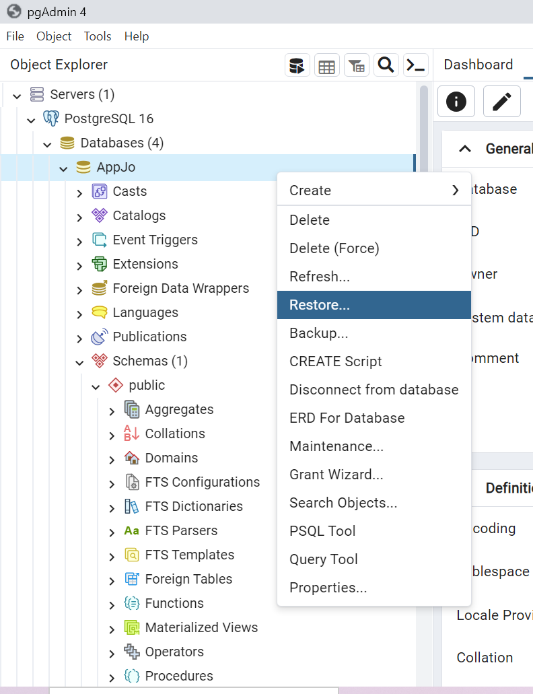

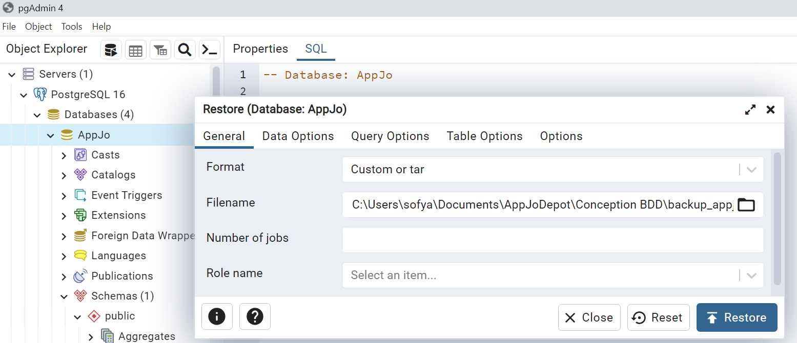

Une fenêtre s’ouvre, dans le champ « Filename » choisirle fichier «backup\_appjo.sql » puis cliquez sur « Restore ».

1.4 Configuration Python dans Visual Studio Code

Installer et ouvrir Visual Studio Code qui est unEnvironnement de Développement Intégré (IDE) .

Installer les modules suivants en ouvrant un terminal enmode administrateur et en entrant la commande pip install pour les modulessuivants :

\-         psycopg2, psycopg2.extras

\-         flask

\-         session

\-         -logingManager, userMixin

\-         os

\-         hashlib

\-         random

\-         logging

\-         string

\-         json

\-         datetime

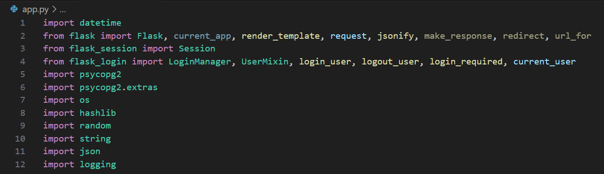

Dans VS Code, ouvrir le projet, composé des différentsfichiers python, Html et Javascript. Cette segmentation de fichier permettra derendre l’application plus flexible, modulable et maintenable.

Dans le fichier App.py :

Par défaut, le port d’écoute du serveur PostgreSQL est 5432.Vérifier donc que la valeur du port d’écoute de votre serveur soit identique àla valeur du port d’écoute spécifier dans le fichier app.py. Si le port pardéfaut (5432) est utilisé, cette ligne peut ne pas être explicite.

Si vous n’utilisez pas l’utilisateur postgres par défautpour vous connecter à la base de données, changez l’utilisateur dans lechamp « user » et mettre le mot de passe associé à l’utilisateurque vous avez choisi dans le champ « password ».

Dans le champ « dbname » il faut qu’il y ait lenom de la base de donnée que vous avez crée plus tôt. Si vous l’avez nommé« AppJo » comme il était indiqué, alors ne changez rien.

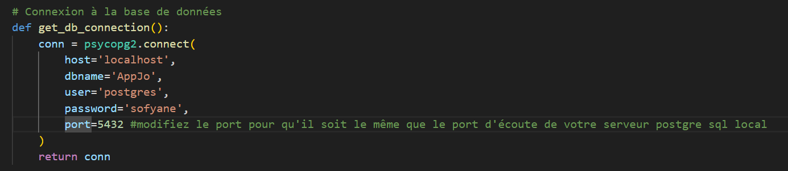

1.5Configuration de la base de données

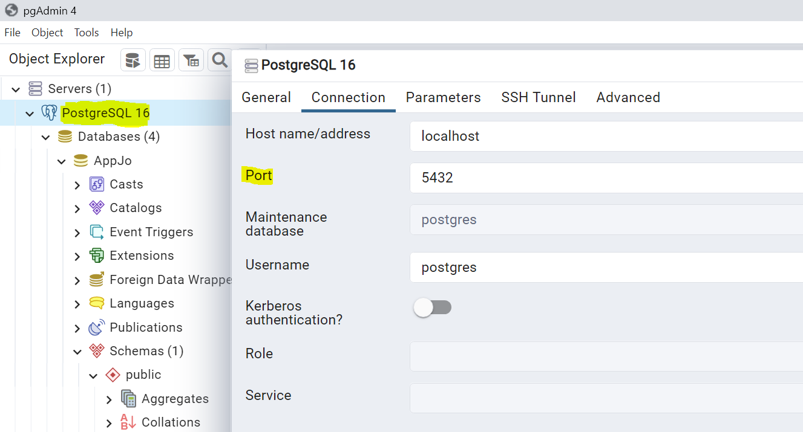

En vous aidant du modèle conceptuel de données, intégrer latable « offres » dans la base de données :

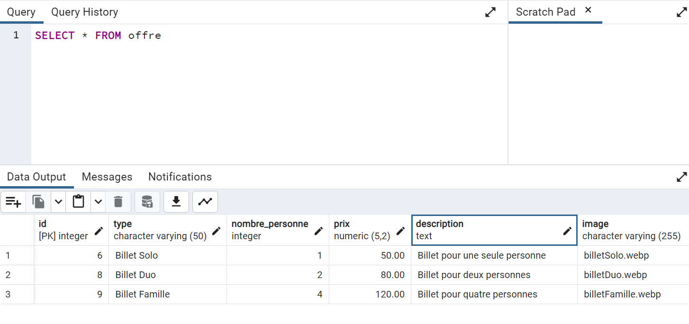

Faire de même pour la table « utilisateurs » et« commande ».

**2 Lancementde l’application app.py :**

2.1 Exécution du programme

Ouvrez dans VSCode le fichier « app.py » puiscliquer sur le bouton en haut à droite pour exécuter le programme qui lancerale serveur Flask.

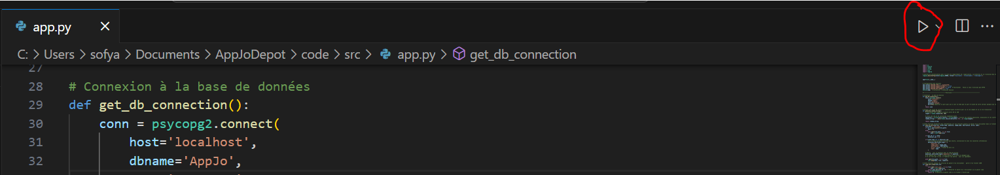

Sinon dans un terminal, accéder au répertoire« AppJoDepot/code/src/ » et taper la commande « pythonapp.py »

Dans le terminal des logs, il apparaît l’URL [http://127.0.0.1:5000/](http://127.0.0.1:5000/) qui sera entré dans le navigateur.

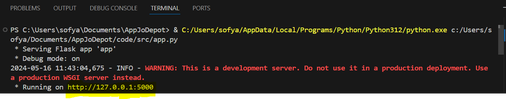

Entrer cet URL sur votre navigateur pour voir afficher lapage d’accueil du site :

2.2 Parcoursclient :

Vous pouvez désormais naviguer sur le site pour sélectionnerles offres désirées dans l’onglet « Billets », pour vous connecteravec votre email dans l’onglet « Connexion/Inscription, et pour achetervos billets dans l’onglet « Panier ».

Cliquer sur « Billet » puis dans la page « Billet »cliquer « ajouter au panier » sur l’offre de votre choix, unmessage vous indique que l’article a été ajouté avec succès, confirmez lemessage en cliquant OK :

Ensuite, sur cette même page, cliquer sur« Panier » pour que le site vous dirige sur la page« Panier » :

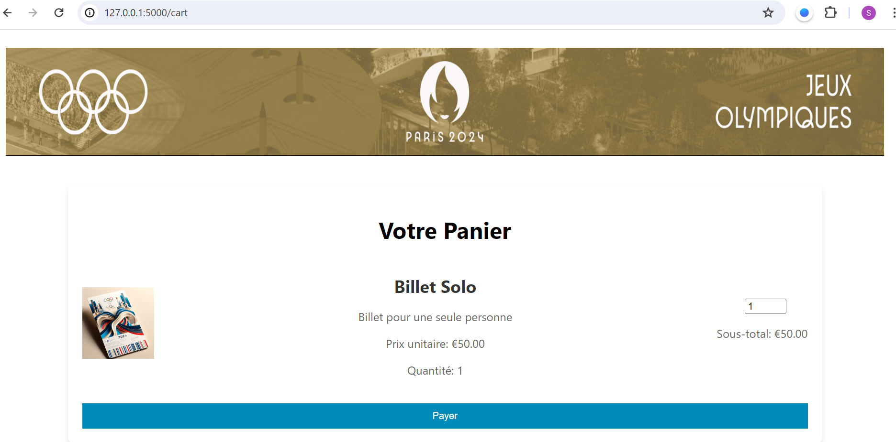

Cliquer sur « Payer » pour rentrer dans le processusde paiement. Une page vous demandera de vous connecter pour payer le billet.

Pour le paiement, il faut d’abord que vous créez votrecompte puis que vous vous connectez.

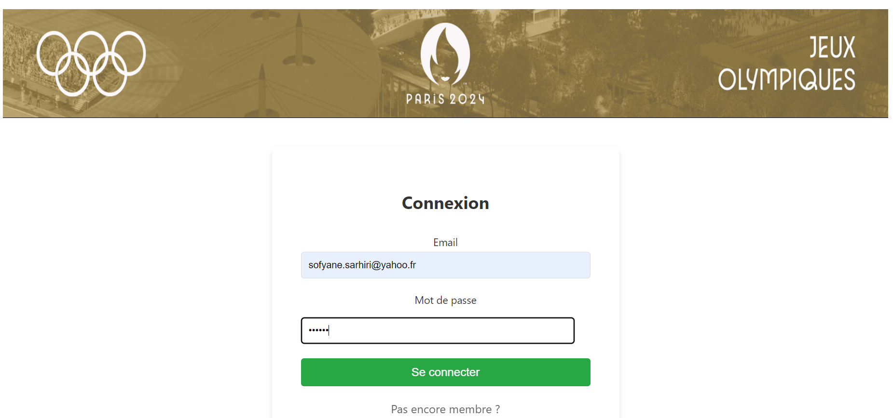

Après connexion, suivez le parcours client jusqu’ à la pagesuivante puis rentrez vos coordonnés. Nous utiliserons des fonctions mockéespour simuler le paiement.

Renseignez les informations de paiement et cliquer sur« payer » pour valider le paiement.

**3 Compte administrateur :**

3.1 Administrer lesoptions d’offres « ajouter », « modifier » et« supprimer »

Lorsque vous vous connectez en administrateur, vous devezsaisir l’URL [http://127.0.0.1:5000/offers](http://127.0.0.1:5000/offers)pour visualiser et gérer les offres. Vous remarquerez l’ajout d’onglets comme« ajouter une offre », « modifier » et« supprimer ».

Bouton « modifier » :

Lorsque vous cliquez sur « modifier », vousremarquerez en bas de page des champs pour modifier les paramètres de l’offre.Par exemple, pour l’offre solo, si vous modifier le prix à 60€ et que vousrajoutez « super ! » dans les commentaires comme ci-dessous.

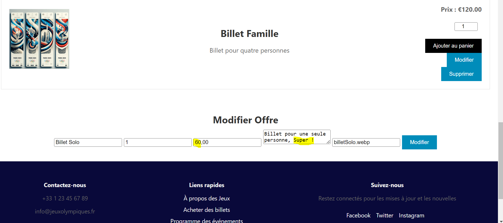

Le billet solo se met à jour dès que vous cliquez sur lebouton « modifier » comme ci-dessous :

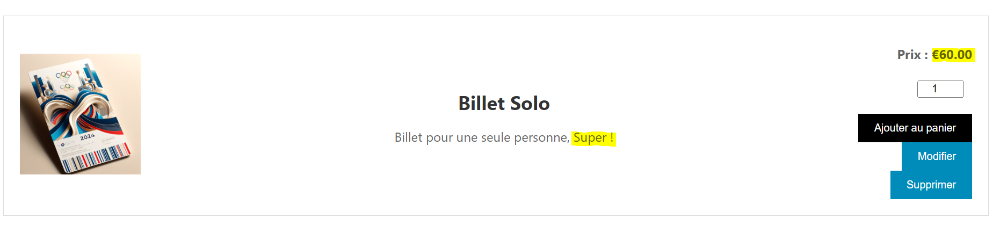

Bouton « Ajouter » :

Lorsque vous cliquez sur le bouton « ajouter », enbas de page vous trouverez des champs pour ajouter votre offre.

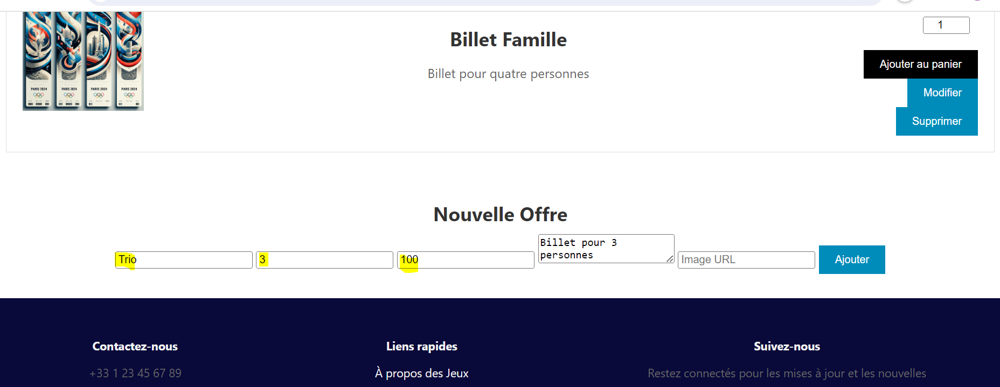

En prenant l’exemple ci-dessus, vous ajouterez l’offre trio,la page affichera donc l’offre en respectant vos choix comme ci-dessous :

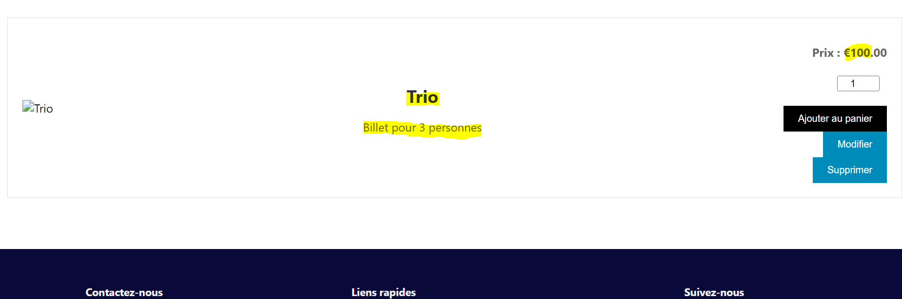

Bouton « supprimer » :

Pour supprimer une offre, il suffit de reprendre l’offretrio que vous avez créer à l’instant et de cliquer sur « supprimer ».

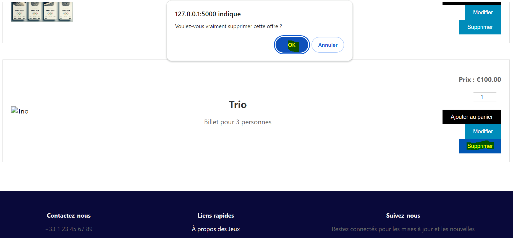

L’offre trio disparaîtra après confirmation sur le boutonOK.

4.Déploiement sur pythonanywhere.com :

4.1 Création et configuration du serveur et de la base dedonnées

Les étapes de la configuration sur PythonAnywhere sont lessuivantes :

\-Connexion à PythonAnywhere avec votre comptePythonAnywhere.

\-Onglet "Web" : allez dans l'onglet"Web" de votre tableau de bord PythonAnywhere.

\-Nouvelle application web : cliquez sur "Ajouter unenouvelle application web".

\-Framework Flask : sélectionnez "Flask" commeframework.

\-Répertoire de l'application : il faut spécifier lerépertoire où se trouve l’application Flask (par exemple,/home/username/myapp). Depuis l’onglet « Files », téléchargez lesfichiers de votre application et déposez les dans le répertoire.

\-Fichier WSGI : il est primordial que le fichier WSGI pointevers votre application Flask (par exemple, /home/username/myapp/app.py). Ce fichierWSGI dit à PythonAnywhere comment trouver et lancer  l’application Flask.

4.1.1 Activation du serveur PostgreSQL

Les étapes de la configuration du serveur sont les suivantes:

Dans l’onglet « Database », cliquer sur « Postgres » àgauche. Sur PythonAnywhere, l’accès à PostgreSQL est payant. On aperçoit lesinformations de l’adresse, du port et l’identifiant administrateur.

Paramètres du Serveur PostgreSQL :

Le serveur PostgreSQL doit être configuré pour accepter lesconnexions externes. Cela implique de vérifier le fichier de configurationpostgresql.conf et pg\_hba.conf sur le serveur PostgreSQL :

postgresql.conf : il est nécessaire que listen\_addresses estconfiguré pour accepter les connexions externes. Par exemple, listen\_addresses= '\*'.

pg\_hba.conf : il faut que les règles dans ce fichierpermettent les connexions du réseau externe. Par exemple, une ligne comme hostall all 0.0.0.0/0 md5 permettrait les connexions de n'importe où. Assurez-vousque cette ligne n'est pas commentée (sans le symbole # au début).

4.2 Création de la base de données

4.2.1 Créer l’utilisateur et la base de données

Ouvirir la console Postgres et ensuite rentrer un script(exemple ci-dessous) pour créer l’utilisateur et la base de données.

CREATE DATABASE appjo;

CREATE USER postgres WITH PASSWORD 'votremot de passe';

ALTER ROLE postgres SET client\_encoding TO 'utf8';

ALTER ROLE postgres SET default\_transaction\_isolation TO 'read committed';

ALTER ROLE postgres SET timezone TO 'UTC';

GRANT ALL PRIVILEGES ON DATABASE appjo TO postgres ;

4.2.2 Connexion avec l’utilisateur

Dans la console, écrire le script adéquat ci-dessous.

psql -U postgres -d appjo -W votre mot de passe

4.2.3 Accéder à la base de données

Vérifier que la base de données créée est disponible. Pour lalister, taper la commande  \\l .

Par ailleurs, pour lister les tables dans la base de donnéesactuelle , taper la commande \\dt . Vous remarquerez qu’il n’existe pas detable.

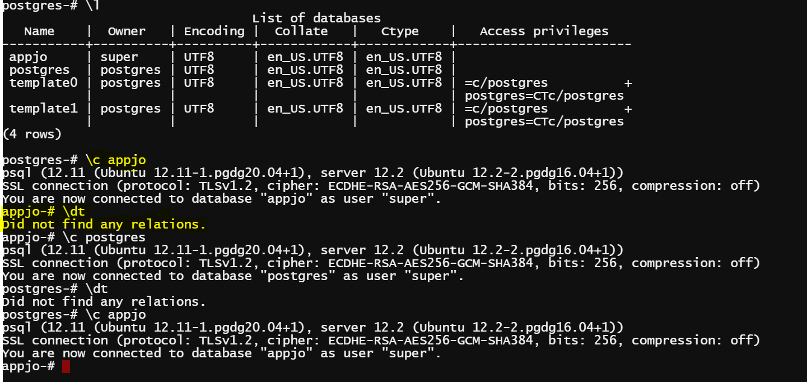

4.2.4 Création des tables de la base de données

Créer les tables sur la console bash de PostgreSQL dePythonAnywhere selon le fichier draw.io « modèle données ». Voustrouverez ci-dessous un exemple pour la table offre :

CREATE TABLE Offre (

    id SERIAL PRIMARYKEY,

    ticket\_typeVARCHAR(50) NOT NULL,

    quantity INTEGERNOT NULL,

    price DECIMAL NOTNULL,

    description TEXTNOT NULL

);

INSERT INTO Offre (ticket\_type, quantity, price,description) VALUES

('Billet solo', 1, 50, 'Billet pour une seule personne'),

('Billet duo', 2, 80, 'Billet pour deux personnes'),

('Billet famille', 4, 120, 'Billet pour quatre personnes');

\-- Ajouter la colonne user\_id avec la contrainte de clé étrangère à la table Offre--

ALTER TABLE Offre ADD COLUMN user\_id INTEGER;

\-- Ajouter la contrainte de clé étrangère--

ALTER TABLE Offre

ADD CONSTRAINT fk\_user\_id

FOREIGN KEY (user\_id) REFERENCES utilisateurs(user\_id);

4.3 Lancement de l’application